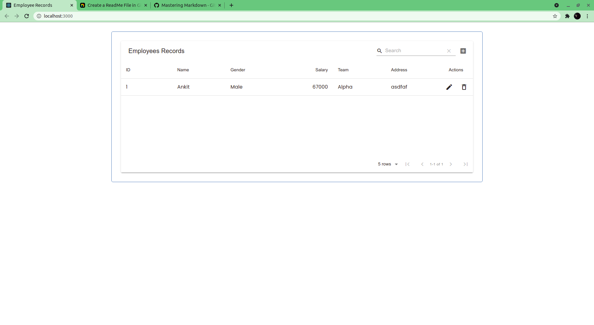
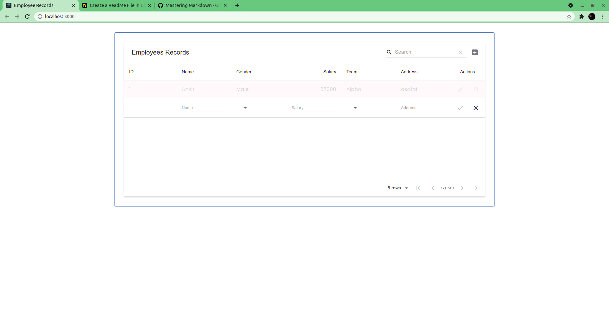

# Employee Management System

#### This is a simple and responsive web-based Employee Management portal that will support following actions-

1. **Add Employee**

   This contains following details-

   - Name
   - Salary (Number)
   - Gender (Drop-Down field)
   - Team (Drop-Down field)
   - Address

   On submitting following details in add section of table A unique ID will be assigned to employee And all details will be saved in our database.

   _Click on `+` icon to add an employee_
   

2. **Delete Employee**

To Delete an Employee Simply Click on `delete` icon , that will delete the employee details from the database.

3. **Update Employee Details**
   Click on `pencil` icon and change the details as required and then hit `correct` icon to save the details or `X` icon to cancel.
4. **Show All Employee details in a table with basic searching and pagination**
   _At bottom right corner of table there is pagination option available-> keep track of pages_
   
   _At top right corner of table there is search option available -> search the employee from a big list easily._

# Getting Started with FrontEnd

This project was bootstrapped with [Create React App](https://github.com/facebook/create-react-app).

## Components used

- **React**
- **Material UI**
- **Material Table**
- **Axios**

## Available Scripts

In the project directory, you can run:

### `npm start`

Runs the app in the development mode.\
Open [http://localhost:3000](http://localhost:3000) to view it in the browser.

The page will reload if you make edits.\
You will also see any lint errors in the console.

### `npm test`

Launches the test runner in the interactive watch mode.\
See the section about [running tests](https://facebook.github.io/create-react-app/docs/running-tests) for more information.

### `npm run build`

Builds the app for production to the `build` folder.\
It correctly bundles React in production mode and optimizes the build for the best performance.

The build is minified and the filenames include the hashes.\
Your app is ready to be deployed!

See the section about [deployment](https://facebook.github.io/create-react-app/docs/deployment) for more information.

### `npm run eject`

**Note: this is a one-way operation. Once you `eject`, you can’t go back!**

If you aren’t satisfied with the build tool and configuration choices, you can `eject` at any time. This command will remove the single build dependency from your project.

Instead, it will copy all the configuration files and the transitive dependencies (webpack, Babel, ESLint, etc) right into your project so you have full control over them. All of the commands except `eject` will still work, but they will point to the copied scripts so you can tweak them. At this point you’re on your own.

You don’t have to ever use `eject`. The curated feature set is suitable for small and middle deployments, and you shouldn’t feel obligated to use this feature. However we understand that this tool wouldn’t be useful if you couldn’t customize it when you are ready for it.

# Getting Started with Backend

This project use `NodeJS` in backend.
And Database used here is `MongoDB`
And many more Libraries/Frameworks like-

- ExpressJS
- Mongoose
- Cors (to connect with frontend)

## Available Scripts

### `nodemon index.js`

Runs the app in the development mode.
Open http://localhost:8000 to view it in the browser.

The page will reload if you make edits.
You will also see any lint errors in the console.

## API Requests

#### _To get List of All Employees from Database_

- Open http://localhost:8000/read to view All Employees in JSON format in the browser.

Others are for Updating and Deleting
